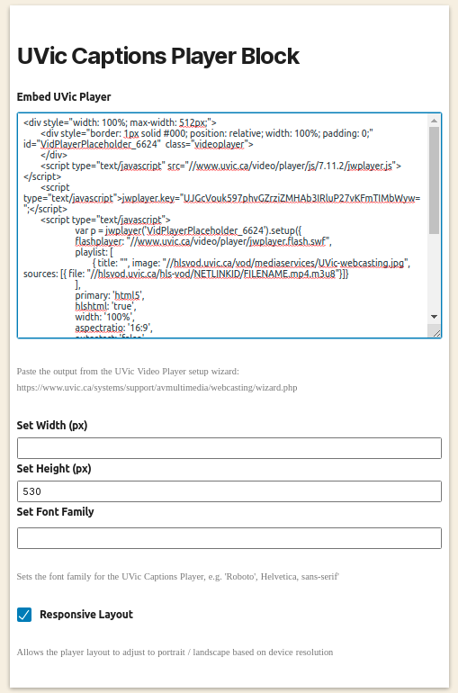

# UVic Captions Player

WordPress Block plugin to embed a JWPlayer instance from
UVic's Video Player Setup Wizard and extract its captions
for annotation with Hypothesis

## Installation

Download and unzip one of the releases into your WordPress plugins folder and activate it from the plugins menu.

This will create a new **UVic Captions Player** block under _blocks/embeds_

## Usage

To add a new UVic Captions Player block to your post or page, select
the **UVic Captions Player** block from the EMBEDS section in the Blocks menu.Paste the output from the UVic Video Player Wizard into the _Embed UVic Player_ textarea and optionally set the width, height, font family, and responsive options.



### Options

| Option            | Description                                                                                                                                                                             |
| ----------------- | --------------------------------------------------------------------------------------------------------------------------------------------------------------------------------------- |
| Embed UVic Player | (Required) - The HTML snippet generated from the UVic Video Player Wizard: https://www.uvic.ca/systems/support/avmultimedia/webcasting/wizard.php                                       |
| Set Width         | (Optional) - The width in pixels of the UVic Captions Player container. If no value is entered, the width is set to auto and is proportional to the height.                             |
| Set Height        | (Optional) - The height in pixels of the UVic Captions Player container. Default is 500.                                                                                                |
| Set Font Family   | (Optional) - Use this field to override the UVic Captions Player font with a different font family (i.e. "Roboto", Helvetica, sans-serif). Note - the fonts must be loaded on the site. |
| Responsive Layout | (Optional) - Allows the UVic Captions Player to swap from landscape to portrait layout based on device resolution. Default is true.                                                     |

## Local Development

__Note__: Local development requires both Docker and Node 12.0.0 or later and requires an npm version greater than 6.9.0.

To develop the UVic Captions Player locally, clone this repository:

```
git clone git@github.com:rochester-rcl/uvic-captions-player-wp.git
```
Create a new folder anywhere on your machine in order to persist the MySQL database used by the Docker service.

Create a .env file in the uvic-captions-player-wp folder with the following environment variables:

```
WP_PLUGIN_SRC [absolute path to the uvic-captions-player-wp folder]
WP_MYSQL_DIR [absolute path to the mysql data folder created above]
```

Install all node modules:

With npm > 7
```bash
cd uvic-captions-player-block &&
npm install --legacy-peer-deps
```

With npm 6.9.*
```bash
cd uvic-captions-player-block &&
npm install --legacy-peer-deps
```

To start the Docker service, run 
```bash
docker-compose up wordpress
```

This will spin up a local version of WordPress available at localhost:8080. You should see the UVic Captions Player Plugin in the Plugins list. If not, check the WP_PLUGIN_SRC environment variable set in the .env file.

To build the block code with hot module reloading, cd into the uvic-captions-player-block folder and run:

```bash
npm run build
```

To run with hot module reloading, run:

```bash
npm run start
```
